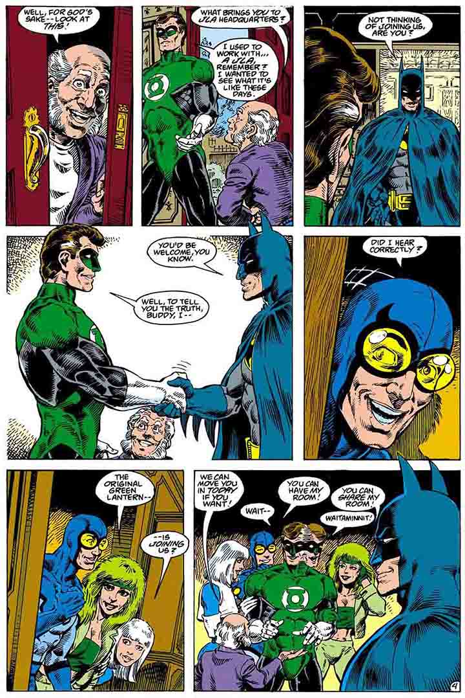
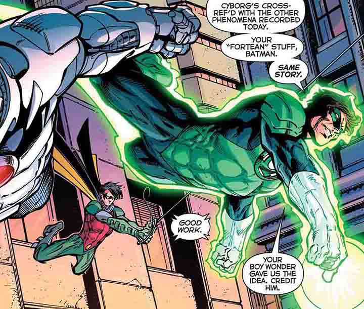

# Bruce Wayne & Hal Jordan 漫画互动

本列表按推荐阅读顺序排序（1994-2011部分，因为有大事件穿插，所以按时间排序，其中连载刊按第一刊出版时间的排序，而不是按我提到的剧情发生时间的排序）。

为了节约流量，本页面的图片经过压缩，全页面约2.3M。

[点击此处](./漫画互动总结-高清.html)查看高清页面（约23M）。

## [Justice League New52 (2011 - 2016)](https://getcomics.info/dc/justice-league-vol-1-5-tpb/)

姐夫（Geoff Johns）的batlantern圣经，绝大部分的画师是Jim Lee，画风超帅，非常适合一见钟情。

第一卷（#1 - #6）n52正联起源，动画电影《正义联盟：战争》~~（和ZSJL）~~的改编基础。著名的摘戒指、仓鼠球、摘面罩、“Who the hell is Bruce Wayne”均出自这一段。

第二卷（#7 - #12）墓魔（Graves），Hal在n52把自己从正联开除的因果。一样充满名梗，不给蝙蝠侠打伞，Hal说Bruce“cuddly”，Barry劝架被两个人一起吼，大型迫害Ollie现场，Arthur说“是只有我，还是蝙蝠侠说话越来越像灯侠了？”~~（建议屏幕前的各位好好学习这种磕CP的精神）~~。

两个名梗。#23，“But you’re **NO** Hal Jordan”。#39，Hal被Barry从Oa叫回来，第一句话先问蝙蝠侠在哪儿。

第七卷（#40 - #44）和第八卷（#45 - #50）是达克赛德战争，坐椅子戴戒指的剧情都出自这里。人生一世，能看到几次蝙蝠侠认错呢？

## [Batman: Universe (2019)](https://getcomics.info/dc/batman-universe-1-6-2019/)

一共六刊，Hal登场的情节在#3-#4，#5里有Bruce背绿灯誓词。~~（Ollie：我至今背不下来，怎样？）~~

恐龙岛约会和西部世界情侣装，名台词“你从来没去过我家”。

## [Green Lantern 80th Anniversary (2020)](https://getcomics.info/dc/green-lantern-80th-anniversary-100-page-super-spectacular-1-2020/)

p12 - p18，Hal的个人故事《Last Will》。Hal以为自己要死了，灯戒只能再发三条消息，第一条发给绿灯军团，第二条发给Bruce，第三条发给了Carol。

“你让我直面我的缺陷，我的恐惧。谢谢你教会我谦逊，Bruce。”

## [The Brave and the Bold (2007 - 2010)](https://getcomics.info/dc/the-brave-and-the-bold-vol-3-1-35-2007-2010/)

Hal和Bruce（和Kara）的合作，#1 - #6。两个人主要的互动在#1，在拉斯维加斯打21点，性格差异极其鲜明。~~虽然Bruce的瞳色上错了~~

## 1994-2011

在94年的翡翠暮光之后，Hal和Bruce的关系一度跌到谷底，大致可以在04年的绿灯重生划一个分界。

94-04这十年，Hal经历了暮光-零时-视差-终夜-审判日-幽灵-灵魂战争一系列事件。而Bruce的人际交往比较容易追踪，大部分时间都在JLA(1997-2006)，其中巴别塔（2000）是一个人物形象的重要转折，而蝙刊内部，缄默、战争游戏、红头罩之下，Bruce也是经历了一个相当折磨的形象现代化过程。

这一段时间，Bruce和Hal的交集主要如下。

### [The Final Night (1996)](https://getcomics.info/dc/the-final-night-story-arc-1996-2011/)

Hal牺牲自己重燃太阳。高虐，所有Hal相关的情节都高虐。如果你喜欢Hal Jordan你一定会哭。就算你看主线不哭，看绿灯v3#64（Hal想变回绿灯侠）和#81（Hal葬礼）怎么也得哭出来。

### [Day of Judgment (1999)](https://getcomics.info/dc/day-of-judgement-1-5-secret-files-origins-1/)

Hal成为幽灵宿主。可以理解为姐夫让Hal起死回生的第一步。

### [The Spectre (2001 - 2003)](https://getcomics.info/dc/the-spectre-vol-4-1-27/)

Bruce与Clark在#2-#4中登场。**这本没有高清资源，画面灰蒙蒙的，所以不建议新人阅读。**

Bruce这边，简单来说是一个他接受Hal从“死”到“回来了”的过程。

### [JLA/Spectre Soul War (2003)](https://getcomics.info/dc/jla-spectre-soul-war-1-2-2003/)

JLA与幽灵Hal的合作，Bruce在暮光之后第一次对Hal持一种还算和善的态度。

下面两页出自Green Lantern Vol 3 (1990 - 2004) #1，Hal造访JLA。

虽然灵魂战争的编剧DeMatteis极力治愈，但显然，Hal和Bruce的关系已经回不到暮光之前的状态了。

------

04年起，Hal重回绿灯侠身份，这一段两个人的关系主要是两边说了算。

一个是各个大事件，另一个是JLA(2007 - 2012)。但两边编剧都很多，JLA还有Roy、Wally、Dinah几个和Hal历史很长的人。

具体成故事线的人物关系就只有姐夫手里短短的一小条，大体来说是Hal逐步重建Bruce对他的信任的过程。

### [Green Lantern Rebirth (2004 - 2005)](https://getcomics.info/dc/green-lantern-rebirth-deluxe-edition-2019/)

更像是承接审判日而非灵魂战争，Bruce对Hal持怀疑态度，不过他接受了Hal的回归。

### [Green Lantern Vol 4 (2005 - 2011)](https://getcomics.info/dc/green-lantern-v4-1-67-free-download/)

发生在#9。Bruce找Hal合作，两个人重生之后修好的第一步。

“你知道，你以前都叫我Hal。”

“声明一下，我很高兴你回来了……Hal。”

这一刊里Bruce戴了Hal的戒指，~~变了一堆蝙蝠，~~看到了父母。这让赛战时他拒绝黄灯戒指变得容易了一些。

（至白之日内）#62，Hal拒绝正联的帮助，和七灯（主要问题在于红橙黄）组队。

### [Infinite Crisis (2005 - 2006)](https://getcomics.info/dc/infinite-crisis-tie-ins-collection-2005-2006/)

共七刊，在#6中，Bruce放弃兄弟眼，选择相信人，而在他做出这个决定之后，第一个出现的人是Hal。

### [Blackest Night (2009 - 2010)](https://getcomics.info/dc/blackest-night-complete-order-extras/)

至黑主刊#00，Hal在Bruce墓前和Barry碰面。

------

### [Superman/Batman (2003 - 2011)](https://getcomics.info/dc/superman-batman-1-87-annual/)

Hal登场在#29，~~我觉得有点剧情工具人的意思，~~他主要是和超人互动，不过有个被Bruce抓领子的画面。

### [Justice League of America (2007 - 2012)](https://getcomics.info/dc/justice-league-of-america-vol-1-10/)

是群像刊，角色特别多。Hal大部分时候在和Ollie、Roy、Dinah、Wally相处，和Bruce的互动并不太多，但毕竟2.6个G下来，有心磕总是有粮的。

第三卷开头（箭雀婚礼的JLA特刊）有Hal管Bruce借（要？）钱，$3600，为了Ollie的单身派对。

### [Cry For Justice (2009 - 2010)](https://getcomics.info/dc/justice-league-cry-justice/)

最终危机之后，Hal、Ollie与JLA分道扬镳，追求“正义”。和Bruce有关系的也就是#1-#2。不建议读到#5及以后，有的心碎一次就够了。

## [Justice League #51 (2016)](https://getcomics.info/dc/justice-league-51/)

泰坦重生的前奏，n52正联成立半年后，蝙蝠老爹带崽上班。Bruce和Hal的直接互动不多，主要视角在Dick身上。

## [DC Universe Online Legends (2011 - 2012)](https://getcomics.info/dc/dc-universe-online-legends-0-26-2011-2012/)

这个是DCUO游戏的漫画，Bruce和Hal相处的剧情在#21。

## [Batman - The Brave and the Bold (2009 - 2010)](https://getcomics.info/dc/batman-the-brave-and-the-bold-1-22-2009-2010/)

蝙蝠侠：英勇无畏动画的相关漫画，Hal出现在#21。

