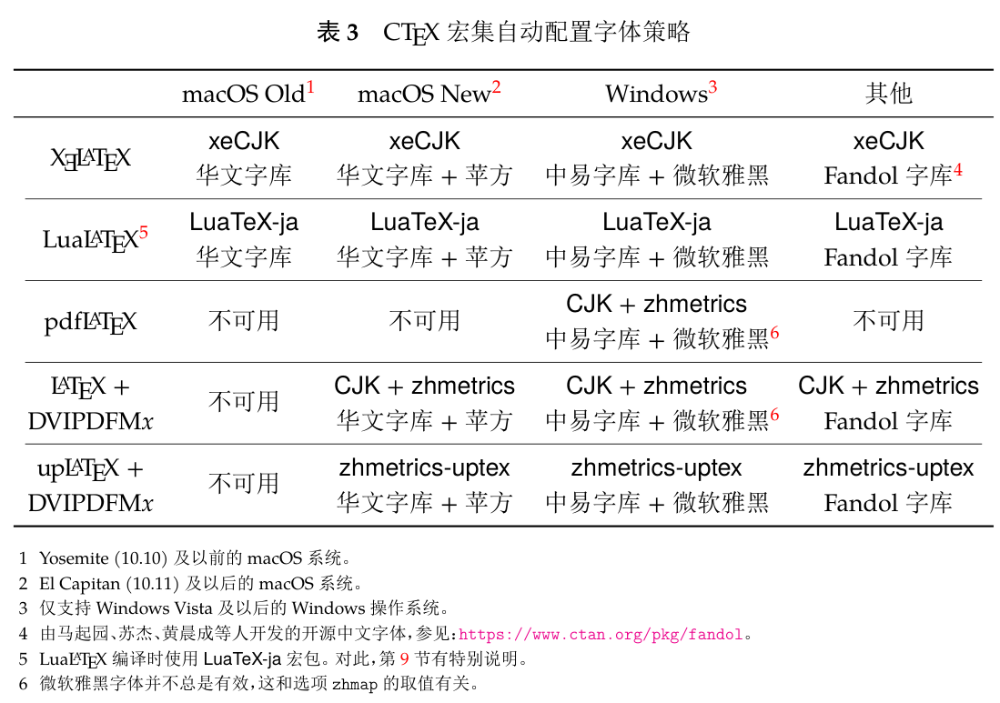
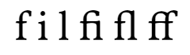
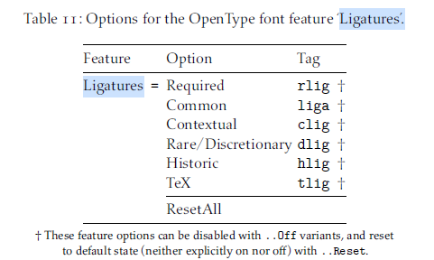
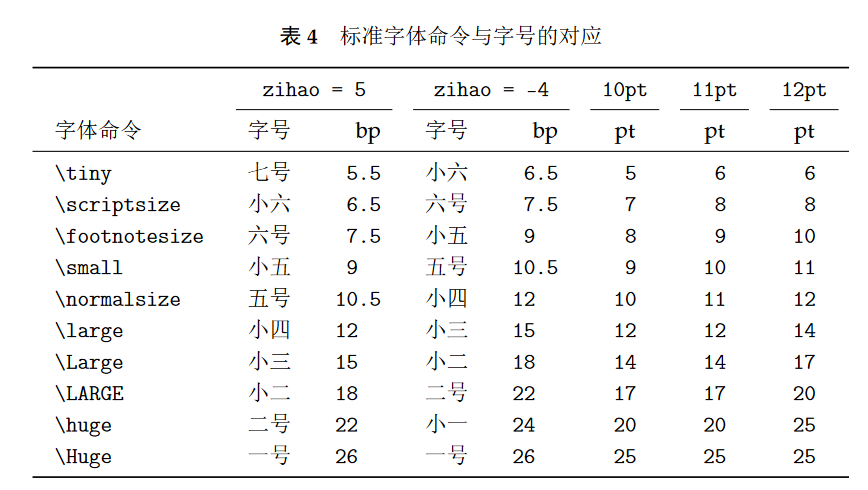
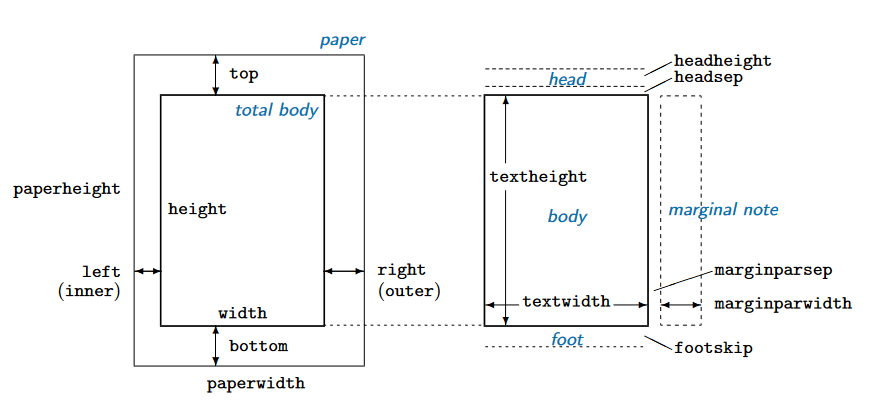

本文为懂得$\LaTeX$基础命令、语法，准备以此为排版工具，制作**书籍类同人本**的玩家撰写。考虑了等宽文字与不等宽文字（通常就是中英文）掺杂的情况。有少量场景与操作系统有关，本文暂只有Windows的解决方案。

其中不包含$\LaTeX$安装等入门内容。这部分教程在网上已经很多，不需要我再抄一遍。

我创立了一个模板，欢迎直接[下载使用](https://github.com/zhuty18/fanfiction-sample)。如果本文或者本模板对你出本有帮助，你出本时感谢我一下也挺好的。（我的ID是兔子草）

本教程包含一些高投入低回报的内容，标注了“（进阶）”的字样。

- [$\\LaTeX$的优点](#latex的优点)
  - [简单易上手](#简单易上手)
  - [纯粹的排版工具](#纯粹的排版工具)
  - [创作与排版的分离](#创作与排版的分离)
  - [编辑与渲染的分离](#编辑与渲染的分离)
  - [默认细节极佳](#默认细节极佳)
  - [一句忠告](#一句忠告)
- [排版参数](#排版参数)
  - [小说](#小说)
  - [全网格化（进阶）](#全网格化进阶)
- [字体设定](#字体设定)
  - [字体入门](#字体入门)
    - [字体类别](#字体类别)
    - [字体风格](#字体风格)
  - [字体名称查询](#字体名称查询)
  - [外语字符字体配置](#外语字符字体配置)
    - [连字（进阶）](#连字进阶)
  - [中文字符字体配置](#中文字符字体配置)
  - [字体选用建议](#字体选用建议)
  - [外语字符配置中文字体](#外语字符配置中文字体)
  - [字体找不到怎么办？](#字体找不到怎么办)
- [文本导入](#文本导入)
  - [$\\LaTeX$正文语法入门](#latex正文语法入门)
- [建立文档](#建立文档)
  - [文档类型和主字号](#文档类型和主字号)
    - [字号使用](#字号使用)
  - [纸张布局](#纸张布局)
    - [出血](#出血)
  - [各级标题](#各级标题)
  - [标题格式](#标题格式)
  - [换页](#换页)
  - [自动空白页](#自动空白页)
- [页面排版](#页面排版)
  - [行高和段距](#行高和段距)
    - [行高](#行高)
    - [段距](#段距)
  - [缩进](#缩进)
  - [孤字和孤行（进阶）](#孤字和孤行进阶)
- [引用](#引用)
  - [段落格式](#段落格式)
  - [文本框](#文本框)
- [注释](#注释)
  - [脚注](#脚注)
  - [尾注](#尾注)
- [目录](#目录)
  - [目录标题](#目录标题)
  - [目录配置](#目录配置)
  - [局部目录](#局部目录)
  - [文档内跳转](#文档内跳转)
  - [页码更改](#页码更改)
  - [目录换页](#目录换页)
- [页眉页脚](#页眉页脚)
  - [页面风格定义](#页面风格定义)
  - [文档自动的标记](#文档自动的标记)
  - [页面风格使用](#页面风格使用)
  - [问题处理](#问题处理)
- [图片](#图片)
  - [插入图片](#插入图片)
  - [图片标题](#图片标题)
  - [旋转](#旋转)
- [杂七杂八](#杂七杂八)
  - [空白页](#空白页)
  - [空白段](#空白段)
  - [规定标点宽度（如中文破折号）](#规定标点宽度如中文破折号)
  - [特殊字符换字体](#特殊字符换字体)
  - [行溢出](#行溢出)
  - [纸面不充盈](#纸面不充盈)
  - [扉页](#扉页)
  - [子文件](#子文件)
- [严格网格排版（进阶）](#严格网格排版进阶)
  - [行高段距设定](#行高段距设定)
  - [版心规划](#版心规划)
  - [正文对齐](#正文对齐)

# $\LaTeX$的优点

一般我们看到讲$\LaTeX$的文章，总难免骂两句这东西磨磨唧唧的渲染、乱七八糟的规范和屎山一样的包。正因如此，无数人试图取代$\LaTeX$，但它目前依然是唯一可靠的学术类排版工具，也是世界上最流行的排版系统之一，这足以证明它的独特价值。

或许这句话有点反直觉，但是外行人想要排出一个“**能看的印刷品**”，$\LaTeX$是最快也最简单的解决方案。

## 简单易上手

[*Overleaf*](https://cn.overleaf.com/)是$\LaTeX$的在线IDE，全网页端，只需注册一个账号就可免费使用。在工作区左侧先点击目录（Menu），将编译引擎换成`XeLaTeX`或`LuaLaTeX`，才可正常处理中文。拼写检查系统不支持中文，建议关掉，不然中文全篇都是拼写警告。

截止到写这篇文档时，*Overleaf*为免费用户提供20秒的编译时间，不放图绝对够用了。（编译一个370页，20万字的本大概需要10秒）。

不过，如果想自定义字体的话，*Overleaf*无能为力，还是需要自己安装*TeXLive*[^1]，在本地进行工作。

[^1]: *TeXLive*：$\LaTeX$的编译器，仅能通过命令行使用，建议搭配*VSCode*或*TeXstudio*等工具。

我的模板传到了*Overleaf*上，但是公开模板需要等待审核检查，等通过了我会在这里放出链接。

## 纯粹的排版工具

目前的DIY出本教程里面，排版这一步都是用*InDesign*。但*InDesign*本质上是**版式设计**软件，面向市场是杂志、画册、报纸等类型。目标情景是一页上要分若干区，有的区填字、有的区放图，设计者主要研究这些区域如何分配面积、如何摆放、如何提升信息传达率、如何保持美观。

那么问题来了，*你真的需要这些功能吗？*还是说，其实你需要的只是一个“能把我想印的那点东西**漂亮又简单地打包成印刷用pdf**”的工具呢？

$\LaTeX$是一个简单粗暴的排版软件。格式越简单、越统一，用它来做就越容易。

排个书、插个图、把一页页画好的漫画封装成指定纸张大小的pdf……放在设计业内属于绝对的轻度需求，而$\TeX$就是为这些轻度需求而生的。**它的目的不是把二十页纸排出花来，而是让八百页的文档看源文件就知道格式不会出错。**

## 创作与排版的分离

$\LaTeX$里，创作和排版天然分离，十分契合同人创作的规律。

出同人本，无一例外是拿着内容补格式。同人文的传播载体是朴实无华的txt，偶有文画双修的大佬，也基本都是图文分离式发放。这样的创作基础天然就适配$\LaTeX$。

$\LaTeX$的使用步骤分为两步，先用文本编辑器撰写工作文件，再用引擎编译出结果pdf。在已有内容的情况下，只需要给内容文件增加简单的标记（基本也就是各级标题，有些作者会有脚注尾注，最多再有加粗斜体），通过简单的代码结构设计实现文档内容与格式的解耦，就能令工作空间简化且专注，只需关注排版的各项参数。

它有一点尤为可贵：手持一份十万字的文稿，正常人的直觉就是把它一次排完，然后对着pdf挑问题一个点一个点修。而排版工具里，只有$\LaTeX$在一排几百页的时候不会挑你的机能。它只会慢，但不会崩。

## 编辑与渲染的分离

排版的本质是把文档变成一堆矢量图。这个步骤中最本质的是编辑（设定格式即转化规则），而最耗时的是渲染。

作为一个没有图形化操作界面的排版工具，$\LaTeX$渲染时可以把所有资源全部用在“得到pdf”这一件事上，效率极高。如果你嫌Windows还是太慢，可以装一个WSL，再提一波生产力。

## 默认细节极佳

如果找一些专业的中文排版攻略读（比如[中文排版需求](https://www.w3.org/TR/clreq/)，[中文排版网格系统的五大迷思](https://www.thetype.com/2020/01/16565/)，），那么就会意识到，文字排版这件事其实非常细碎繁杂，需要关注的细节极多。

由于开源的特性，$\LaTeX$内有着大量前人造好的轮子，可以覆盖排版时应当处理的普适性专业细节，极大地节约工作成本。用户只需要进行自己的个性化即可。对于中文，最显著的案例就是标点压缩和字距。

- 标点压缩。在正式的排版原则中，使用全角标点时标点的宽度是会变的。较为常见的几个状态如下

    1. 独立标点为1个字符宽
    2. 连续的两个标点（如`：“`）合并挤压为1.5个字符宽
    3. 段首的起始标点（如`“`、`《`等）为0.5个字符宽

- 字距。字距指文字之间的水平间距。一份理想的中文文本，应该满足以下条件：

    1. 行宽可以规定
    2. 文字每行左右均顶格，恰好占满设定的行宽
    3. 当汉字与外语字符/阿拉伯数字相邻时，间距一个空格宽
    4. 在没有干扰的情况下，文字竖对齐。主要是最后一行，如果前文的字距不为默认值，那么最后一行的字距应与前文相同，而非简单左靠

这些细碎的设定，在$\LaTeX$的`ctex`包中默认就会满足。不需要自己进行任何选择或调整`ctex`包默认就提供最美观的排版。（破折号略有些问题，我在后文里附了解决方案）

字母类文字排版时会遇到的关键问题是，一行文字几乎不可能在换行处恰好断开。$\TeX$对此的默认处理方案可谓是视觉上最美观的。Knuth-Plass算法通过断字和拉伸，使得一段文本每行左右两侧都能对齐，且肉眼基本无法看出每行空格宽度的区别。

正因有如此基础，$\LaTeX$处理混合文本时的便捷程度天下无双。

## 一句忠告

$\LaTeX$是非常容易催生强迫症的，**千万不要追求完美**。谨记，我们做的是同人本。

# 排版参数

## 小说

版式设计是为了优化信息的传达。对于小说，最重要的信息永远是故事本身，即文字内容。因此，没有必要太深入地研究版面设计。但完全不管也不行，“易读性”和“可读性”是必须要考虑的。

易读性即Legibility，对每个基础单元（中文的字、英文的单词）的识别程度，更多地指向字体。可读性即Readability，即阅读体验的舒适性。在排版中，可读性代表一段文本的阅读容易度，主要指向基础单元的排布方式，例如字距、行高。

这都是排印学里非常根本的课题。有太多的人已经研究过了，我们可以直接使用现成的结论：

行高：中文的行高一般至少是字高的1.5~1.8倍，具体数值受字体和字号的双重影响。如果行高不足，汉字等高的特性会使得行与行之间空隙不清晰，降低阅读流畅性。

行数：翻页的频次主要是行数决定的，这个数极大地影响阅读体验。对于A5大小的纸张，可以以25为参照，每页行数小于等于25时，阅读体验比较休闲，反之行数越多，越接近于专业性强的书籍，阅读体验越严肃。实际使用中，23-27行适用于小说类文章排版。

单行字数：A5这个纸张大小还没有充分利用人眼的视野空间，因此单行字数只受限于字体大小和文字区域的宽度，不需要考虑人眼阅读能力而额外分栏。通常的书籍是每行28~30个字，实际体验上，26~32都是可接受的。


具体选择什么样的参数，建议按自己的需求来决定。决定一个本子气质的是单页信息量（可以简单用行数*单行字数来量化）。同字号下，单页信息量越大，阅读体验越严肃；越小体验越活泼。比方说，一行18个字，2倍行高就可以轻松打造移动端的阅读体验。

但请注意，*排版越疏松，本子越厚*。***本子越厚，成本越高***。印厂算钱的时候只看页数，不看油墨密度，页数越多就越贵。并且，对于字数较多的本，不紧凑一点真的会印成砖头的。

一个更直观的算法：`每页行数*每行字数`得到`理论每页字数`，是一页纸理论上能印的字数，但实际上不可能印满（~~出版物上标注的字数是版面字数，约等于理论字数乘页数，所以给人的感觉很注水~~）。理论值乘上`0.6~0.65`才是实际上的`平均每页字数`。整个本的字数除以`平均每页字数`可以得到大约的正文页数（排版增加的留白已经考虑在内）。最通用的80g纸，厚度是0.11毫米。

所以用`总字数/每页行数/每行字数/11.364`就可以得到一个大约的厚度（单位为毫米）。

## 全网格化（进阶）

在正式出版物中，还有其他~~强迫症发作的~~进阶规则。

1. 行宽是整数个字的宽

    即一排汉字能将一行恰好排满，提升每页纸上的网格感。

2. 标题所占高度是整数个行的高

    使得不同页面格式中，正文都能实现跨页行对齐。

这些规则本质上都是令阅读体验更接近于排字印刷时代，但是到了现代，出版社也不是一定遵守这些规矩，姑且看看，了解一下即可。除非有很强的强迫症，不然不需要应用。

------

了解了以上内容后，就让我们进入正题，开始使用$\LaTeX$进行排版。

# 字体设定

如果你使用*Overleaf*在线编译，将无法安装自定义字体。

## 字体入门

### 字体类别

字体可以简单分为有衬线（Serif）和无衬线（Sans Serif，或简称为Sans）两类。衬线指的是笔画边角处的装饰，例如宋体是典型的衬线字体，而黑体是典型的无衬线字体。

纸张上，有衬线的字体易读性更佳，一般用于正文中；无衬线字体更加醒目，可以用于标题。

等宽字体（mono）指所有字母和符号都占据同样宽度的字体。对于中文等符号文字没有意义，咱天然就是等宽字体。对字母文字而言，等宽的易读性并不太好，应用场景很有限。除了故意模仿打字机的文字质感外，只有编程为了竖对齐使用等宽字体。

### 字体风格

一个字体名是一个系列，其中往往有多个风格，最重要的是各种字重和斜体。

字重：描述一个笔画有多粗。

从轻到重（从细到粗）分别有：thin，extra light，light，regular(normal)，medium，semi bold，bold，heavy(black)。一个字体必然有字重关键词，留空时会自动使用regular。原则上的加粗行为就是字重从regular变成bold。如果一个字体没有bold字重，word还会用算法生成一种伪粗体。

斜体：Italic，严格上来说应该叫意大利体。字母文字排版时产生的风格化方案，**中文其实没有斜体**，承担类似功能的是楷体或仿宋。

不是所有字体都有意大利体，很多时候我们看到的也是算法计算的伪意大利体。方案是简单将字符拉斜一些，不涉及意大利体中常见的字形变化。这种伪意大利体其实才该叫斜体（Slanted）。但由于这些风格本身的舶来性，加之Slanted几乎没什么专门的用处，大家已经习惯将Italic称作斜体，因此我后文也沿用这种通俗的误称。

##`ctex`包介绍

$\LaTeX$需要`ctex`包来处理中文，需要`xelatex`或`lualatex`引擎才能编译。使用方法为

```latex
% 方案一
% 在建立文档时指定使用ctex，Z代指文档类型
\documentclass{ctexZ}

% 方案二
% 建立文档后引入包
\usepackage{ctex}
```

方案一相当于建立中文文档，方案二相当于在英文文档里使用中文。方案一自动将所有预设词翻译为了中文，更加便捷；方案二在细节上更加通用。例如，按方案一生成的目录中，标题内“第x章”“第x部分”等字样需要用`\ctexset`命令来调整；而方案二可以用更加基础（i.e.与其他包兼容性更好）的方式对这些地方进行自定义。

`ctex`包默认根据**当前操作系统**选择字体配置，策略如下



`ctex`包内有若干套预设好的字体配置，可在导入时使用`[fontset=X]`选择，`X`为包名，详见下表。

|包名（`X`）|使用字体|版权|
|:-----------:|:--:|:--:|
|`adobe`|Adobe公司的四款中文字体|付费商用|
|`Fandol`|*Fandol*中文字体|GPL+FE协议开源：放入文档中可以随意使用✅<br>基于此字体改编、修改等所有再创作的字体产品，均必须同样继承GPL+FE协议开源|
|`founder`|方正公司的中文字体|书宋/黑体/楷体/仿宋四种为免费商用✅<br>原则上需要申请一份书面授权书|
|`mac`|macOS系统下的字体|印刷时存在侵权问题|
|`macnew`|ElCapitan或之后的多字重华文字体和苹方字体|见上|
|`macold`|Yosemite或之前的华文字体。|见上|
|`ubuntu`|思源宋体、思源黑体和$\TeX$发行版自带的文鼎楷体|免费商用✅|
|`windows`|中易字体和微软雅黑字体|付费商用|

*TeXLive*自带字库中包含*Fandol*系列，各平台均可`[fontset=fandol]`加载全套*Fandol*字体配置，简单达到跨平台统一。但是它只含GB2312内的字符，可能会出现缺字。如果出现这种问题的话，还是只能自行配置字体。

## 字体名称查询

首先是寻找字体。代码寻找字体需要使用字体的系统名称，在Windows中，简单的查找系统字体方法是运行`fc-list`命令。注意$\LaTeX$只能找到$\LaTeX$内自带的字体和`C:\Windows\Fonts\`目录下的字体。因此安装字体时，需要选择**为所有用户安装**。

可以用系统命令`fc-list >> fonts.txt`生成一个字体表文件，包括系统上的可用字体。增加`:lang-zh`参数可以指定过滤筛选中文字体。注意一些字体虽然使用时是中文，但其字体文件会被识别为日文或韩文，不会出现在结果中。确定**英文系列名**时，可以用`fc-list | Select-String "系列名"`来筛选字体列表。中文名可能会是乱码，建议只用英文名进行此项操作。

得出的结果中包含字体名，这里使用开源字体*Vollkorn*系列举例，`fc-list | Select-String "Vollkorn"`得到的结果如下

```
C:/Windows/fonts/Vollkorn-Medium.otf: Vollkorn,Vollkorn Medium:style=Medium,Regular
C:/Windows/fonts/Vollkorn-Italic.otf: Vollkorn:style=Italic
C:/Windows/fonts/Vollkorn-Bold.otf: Vollkorn:style=Bold
C:/Windows/fonts/Vollkorn-MediumItalic.otf: Vollkorn,Vollkorn Medium:style=Medium Italic,Italic
C:/Windows/fonts/Vollkorn-BoldItalic.otf: Vollkorn:style=Bold Italic
C:/Windows/fonts/Vollkorn-Regular.otf: Vollkorn:style=Regular
C:/Windows/fonts/Vollkorn-SemiboldItalic.otf: Vollkorn,Vollkorn Semibold:style=Semibold Italic,Italic
C:/Windows/fonts/Vollkorn-Semibold.otf: Vollkorn,Vollkorn Semibold:style=Semibold,Regular
```

其中`*.otf:`和`:style`之间的即为字体在系统里的名称。对于字体的特殊风格，可以直接以`字体名 风格`作为字体名加载，如`Vollkorn Semibold Italic`。切记区分大小写，有的字体里会是`SemiBold`，有的是`Semibold`。

注：一些字体名中含有`-`，在打印时会增加转义符显示为`\-`，使用这些字体时输入`-`即可。

另外，也可以使用[FontDrop!](https://fontdrop.info)网站解析单个字体文件，获得字体名。解析样例字体*EBGaramondSC12-Regular.otf*时结果如下。

```
You see EB Garamond SC

Name: EB Garamond SmallCaps 12 Regular. Style name: 12 Regular. Version 0.016
© Created by Georg Duffner with FontForge 2.0 (http://fontforge.sf.net)

License: Copyright 2010-2013, Georg A. Duffner (<http://www.georgduffner.at/ebgaramond|g.duffner@gmail.com>), 2013 Siva Kalyan This Font Software 
```

其中`You see`后的是字体系列名，而`Name`与`. Style name`之间的即为字体本身在系统里的名称（对于风格字体，即为指定时使用的名称）。

## 外语字符字体配置

$\LaTeX$的字体配置默认是**只对部分字符生效**的，需要分别配置，混排时可以叠加指定。

我们先说外语字符。`ctex`包只对中日韩三语起效，其他语言的字符（不止为ASCII，还包括章节符$\S$和摄氏度℃等符号）是默认使用基础字体渲染的，只有`fontspec`包配置的字体才能起效。

```latex
% 引入包
\usepackage{fontspec}
% 设置主字体
\setmainfont{Vollkorn}
```

可以设置三种基础类别的字体：主字体`\setmainfont`用`\rmfamily`调用；无衬线字体`\setsansfont`用`\sffamily`调用；等宽字体`\setmonofont`用`\ttfamily`调用。一般设个主字体就够了，其他两种字体是默认格式中使用的，自定义格式时反正也要覆盖掉。

用`\newfontfamily`配置新的字体。

```latex
% 设置字体，并自定义字体名\medfont
\newfontfamily\medfont{Vollkorn Medium}
```

$\LaTeX$默认寻找同系列的字体作为其加粗和斜体，但可以自行进行指定。

```latex
% 设置字体，并自行配置加粗和斜体
\newfontfamily\medfont{Vollkorn Medium}[BoldFont=Vollkorn Semibold, ItalicFont=Vollkorn Semibold Italic]
```

使用非主字体时，只需要输入配置时设定的字体名即可。

```latex
\begin{document}
    % 一次性使用
    \fontspec{Vollkorn medium}[...]
    % 预先设定好
    \medfont medium weight text
\end{document}
```

### 连字（进阶）

英文衬线字体中存在连字（ligature），通过设计优化某些字符串的显示方式来提升易读性。最经典的三个案例如下图（字体为*Vollkorn*）。



$\LaTeX$默认载入一部分通用连字（OTF中tag为liga），能提升英文文本的易读性。而一些字体对连字的设计比较充分，还使用了其他的连字tag。通常类别有：clig指上下文连字（contextual），能使手写体中产生连笔；dlig指自由连字（discretionary），会使文字更花俏；hlig指历史连字（historical）能令文字看起来较为复古；rlig标记必需连字（Required），可以实现“将英语字母拼合得到其他字母”，例如ae拼合为æ。



配置时可以添加一个`[Ligatures=XXX]`参数，启用一些其他tag里的连字，见上图。其中Common是默认打开的。

可以用[FontDrop!](https://fontdrop.info)这个网站来查看字体内连字。有些字体虽然设计了连字，但并没有正确标注，导致这些连字虽然存在但却无法使用。面对这种情况，可以用[FontForge](https://fontforge.org/en-US/)软件进行[手动标注](https://fontforge.org/docs/tutorial/editexample4.html)。

## 中文字符字体配置

中文字符，如`你`，`我`，`；`（中文分号），`？`（中文问号），均需要使用`ctex`包内的命令进行字体配置才能正常显示。

如果使用`ctex`包字库的话，字体命令已经预定义好了。主字体默认为宋体，加粗为黑体，斜体为楷体，等宽（`\ttfamily`）为仿宋。

```latex
\songti 宋体
\heiti 黑体
\fangsong 仿宋
\kaishu 楷书

% 只对 windows、founder 和 macnew 字库生效
\lishu 隶书
\youyuan 幼圆
```

如果选择自定义，首先要引入包时用`[fontset=none]`避免加载默认字体集，防止产生冲突。

```latex
\documentclass[fontset=none]{ctexZ}
% 或
\usepackage[fontset=none]{ctex}
```

字体配置的命令和`fontspec`包的差不多，加个`CJK`即可配置中文、日文、或韩文的字体，配置出的字体只会对这三种语言内的字符生效。

```latex
% 主字体
\setCJKmainfont{Source Han Serif}[BoldFont=Source Han Serif SemiBold, ItalicFont=FZKai-Z03]

% 以下是六种常用的GBK免费商用中文字体

% 思源系列字体有Source Han和Noto两个名字，是一样的
% 通常有语言后缀，CN（中文）或SC（Simplified Chinese）都可以用
\newCJKfontfamily\songti{Source Han Serif} % 思源宋体
\newCJKfontfamily\sheiti{Source Han Sans} % 思源黑体

% 可能会有S（简体）T（繁体）两种后缀，对应GB2312字符集，不建议用
\newCJKfontfamily\shusong{FZShuSong-Z01}% 方正书宋
\newCJKfontfamily\fangsong{FZFangSong-Z02} % 方正仿宋
\newCJKfontfamily\heiti{FZHei-B01} % 方正黑体
\newCJKfontfamily\kaiti{FZKai-Z03} % 方正楷体
```

其中，方正系列四个字体都只有一个字重，而思源两个系列都具有extralight，light，regular，medium，semibold，bold，heavy七个字重，可以进行指定。所有字体中都不含斜体。

## 字体选用建议

想看字体效果，先要有一个好使的pdf阅览器。

打印的分辨率是300dpi，而屏幕的分辨率鲜少到达这个级别，屏幕上预览的pdf，精度比起打印机通常是压缩了的。由于渲染机制原因，不同pdf阅览器通常有着不同的压缩效果，建议找一个使用方便，且页面模式下与放大到300dpi下效果最相似的。个人经验中，Windows端的Acrobat DC Pro在英文花体字上发生了笔画显著过细的现象，而SumatraPDF和Edge，Firefox，Chrome均未出现此问题。

- 中文

中文的可选字体其实不少（[开源字体可以见此名单](https://drxie.github.io/OSFCC/)）。我并不大懂字体设计，仅从各方面收集到的资料来看，方正系的字体适用范围最广、知名度最高，设计应该是最佳的。复读，在找方正字体文件时请一定找GBK后缀（书宋为8.87M），而非GB2312或简体后缀（书宋为2.63M）。这样文字比较全。

实际使用时，推荐将方正书宋（书宋即完全针对书籍印刷设计的宋体）作为主字体，指定方正楷体或仿宋作为斜体，以便于在正文中标注少量字符（如引用），这样易读性较佳。

不过，方正书宋只有一个字重免费，固然技术上可以将较粗的思源宋体或方正黑体作为粗体使用，但因为细节差异众多，看起来会很古怪，并不推荐。如果对加粗有明确需求，请挑一款多字重的字体作为主字体。不过，依然可以搭配方正字体作为斜体。

装饰性文字（脚注、页眉页脚等）建议使用方正仿宋或楷体。

各级标题字体建议用不同字重的思源宋体来显示。

思源系列开源，在网上版本很多，不好说谁做了哪些微调。对于一些字体，可以增加使用`[CharacterWidth=Full]`这个参数，来调整一些字符（通常为标点）的宽度。

- 外语

外语的免费字体很多，绝大部分都支持拉丁字母的变体（如é），一部分支持希腊和西里尔字母，选择字体时检查文本所用符号即可。在挑花眼的同时，最好也关注一下一些进阶选项，以提升混排效果。这里介绍一些实用的花招，更详细的推荐阅读`fontspec`包文档。

以下是一些样例，中文使用思源宋体Regular；英文字体均是从网站[1001 Fonts](https://www.1001fonts.com)下载的免费商用字体，全部使用Regular字重的默认配置。


思源宋体内置的拉丁字体并不美观，这就是为什么我推荐混排。

*Neuton*的字母偏小。配置时可用`[Scale=比例]`参数放大。

*EB Garamond*的字母与中文相当契合，但数字采用了与英文相同的三格设计（俗称OldStyle），在数字与汉字混排时看起来会很诡异。可使用`[Numbers=Lining]`切换到等高数字。注意此方案起效建立在字体中含有等高数字的前提下，不是所有字体都支持。

*Spectral*的字距比起中文明显偏高。可使用`[LetterSpace=改变值（如-3）]`来降低字母间距。另，如果想要调整空格宽度，使用`[WordSpace=空格宽度]`参数即可。

不过本质上，**混排字体的选择取决于文本的字符频**。如果文中存在大量字母（例如ABO中，Alpha/Beta/Omega三个单词会反复出现），那么就应当主要关注字母能否融入正文。

## 外语字符配置中文字体

有的中文字体中也一并包含了同风格的外语字符设计。如果需要使用，将其用`fontspec`包内命令加载，然后叠加使用即可。

```latex
\newfontfamily\songtien{Source Han Serif}

\songti\songtien 中英文mixed文本
```

这样用起来很简单，但是不推荐，基本不太可能好看。

## 字体找不到怎么办？

第一步，确定字体确实安装在了`C:\Windows\Fonts`文件夹里。

第二步，检查代码中的拼写和`fc-list`命令获得的一样，特别是大小写。

第三步，在字体名称外面加个中括号。别问为什么，我也不知道，总而言之亲测有效。

```latex
% 修改前
\newCJKfontfamily\xbsong{Source Han Serif SemiBold}
% 修改后
\newCJKfontfamily\xbsong{[Source Han Serif SemiBold]}
```

第四步，直接配置字体文件名。只要字体装进了默认路径，用这个方法就可以百分百找到。该方案只支持XeTeX和LuaTeX两个引擎，巧了，就是支持中文的两个引擎。

```latex
\newfontfamily\vollkorn{Vollkorn-Regular.otf}
```

第五步，用[FontDrop!](https://fontdrop.info)网站解析单个字体文件，获得字体名，和`fc-list`里获得的可能会不一样。

第六步，天涯何处无芳草，字体到处都是，换一个吧。

# 文本导入

对于已标记好的文本（包括但不限于.docx，.md，.rtf，.epub），用`pandoc`转化然后手动检查一遍即可。如果连`pandoc`都懒得装，也有很多转化$\LaTeX$的网页工具。注意转化会完全继承原文档的格式，大部分时候会有冗余，手动清掉即可。

中文和外语标点存在Unicode码重叠，自动转化工具通常会将标点按外语机制转化，看不顺眼的话，全文替换换回来也不影响使用。

|标点|中文写法|外语写法|
|:--:|:--:|:--|
|省略号|`……`|`\ldots\ldots`，其后可能有` `（一个空格）或`{}`（一组大括号）|
|左引号|`“`|``` `` ```（两个反引号）|
|右引号|`”`|`''`（两个单引号）|
|破折号|`——`|`------`（六个“严格来说叫连字符”的减号）|

破折号有点复杂，见后文[规定标点宽度（如中文破折号）](#规定标点宽度如中文破折号)。

## $\LaTeX$正文语法入门

对于txt文件，需要手动写一下。$\LaTeX$内容写作语法复杂度只在公式上，普通文本只比txt复杂一点点。如果嫌我写得太抽象了，在*Overleaf*上找点模板玩玩即可理解。

1. 文件结构

    $\LaTeX$文件分导言区和正文区。导言区用于编写预设，正文区用于放置文档内容。

    ```latex
    % 导言区
    \begin{document}
        % 正文区
    \end{document}
    ```

    导言区的内容在开始制作文档时即全部生效，而正文区的内容在$\TeX$编译到此处时才会起效。

2. 正文

    正文分段需要使用两个回车（即空一行），连用额外的回车视作无效。

    空一段的方法见后文[空白段](#空白段)。

    单个回车在排版时会视作空格。

    用`\\`可以在不换段的情况下换行。

    加粗方法：`\textbf{加粗内容}`

    斜体方法：`\textit{斜体内容}`

3. 特殊字符：如下特殊字符在$\LaTeX$中有特殊意义，在正文中使用时不能直接写

    百分号（`%`），$\LaTeX$将其视作注释标志，在正文中使用时请用`\%`。

    反斜杠（`\`，又叫转义符），用处多种多样，在正文中使用时请用`\textbackslash`。

    大括号（`{`和`}`），默认按分割标记理解。在正文中使用时，请用`\textbraceleft`和`\textbraceright`。

4. 标题

    有序标题的标记方法是`\级别{标题内容}`。序号标记会自动处理，不用写进正文文档区。

    无序标题的标记方法是`\级别*{标题内容}`。不含序号标记，不会参与索引建立。

好了，你入门了。

# 建立文档

在前文中，你可能已经建立过一些测试文件来研究代码了，在这一节中，我们所讨论的是正经的印刷文档。

## 文档类型和主字号

文档类型通常放在文件第一行，较为直观，但不放在那里也行。

```latex
\documentclass[10pt]{book}
```

$\LaTeX$原生有着`article`、`book`、`report`三种文档类别，对应的`ctex`类分别为`ctexart`、`ctexbook`、`ctexrep`。三种类别的主要区别在默认层深和排版方式上，虽然排版之后肯定要自己改，但为了直观，本教程推荐使用`book`类。

`book`类默认支持三种正文字号10,11,12pt。三种字号可读性都属不错，不建议更大或者更小。如果一定想用其他的，可以使用`extbook`类文档，支持8,9,10,11,12,14,17,20pt的正文字号。

具体选择时，可以用“磅数÷2.845=毫米数”来计算文字大小。也可参考word，word中的五号字是10.5磅，小四则是12磅。

`ctex`文档类别除了10,11,12pt外，还支持word款的两种正文字号，配置方法如下

```latex
% 正文五号字
\documentclass[zihao=5]{ctexbook}
% 正文小四号字
\documentclass[zihao=-4]{ctexbook}
```

### 字号使用



在不同的文档字号时，各个字号命令的对应的字号如上图。

可以用`\ctexset{ziju=额外倍数}`来额外改变字距，但是不设定的话就是最好看的了。

## 纸张布局

一般来说，同人文本的尺寸是A5左右。标准A5是148*210mm，实际中印厂的尺寸不一定能到这里，但我个人还是建议按标准尺寸来做设计，边距留一些余量，印厂不能满足的话再压缩。

`geometry`是处理布局的包，参数极多，这里只介绍少量常用内容，有其他需求建议阅读文档。



注意水平方向`left, right`和`inner, outer`这两组是二选一的关系。双页印刷应当使用`inner, outer`这组参数，能根据页面单双自动调整文字区域位置。

```latex
% 引入包
\usepackage{geometry}
\geometry{
    % A5纸张标准宽高
    paperwidth=148mm,
    paperheight=210mm,
    % 天头，文字区到纸张上沿的距离
    top=17mm,
    % 地脚，文字区到纸张下沿的距离
    bottom=23mm,
    % 切口，文字区到纸张被翻开一侧的距离
    outer=13mm,
    % 订口，文字区到纸张被装订一侧的距离
    inner=21mm,
    % 文字区和页眉下沿之间的空白
    headsep=7mm,
    % % 页眉的高度，一般不需要这行
    % headheight=6mm,
    % 文字区和页脚下沿之间的空白
    footskip=12mm,
}
```

版式规定时，水平竖直方向各三个参数即可，最后一个会自动计算。约束了纸张和版心大小后，内外只定1个就可以了。

`\geometry`命令会决定纸张的大小，这点不可修改。边距等版式数值可以在文档内部用`\newgeometry`命令进行修改，如

```latex
\begin{document}
    % ...
    % 新的边距会从当前页起效
    \newgeometry{left=30mm,right=30mm,top=20mm,bottom=20mm}
    % ...
    % 将边距重置为\geometry命令中设置的
    \restoregeometry
    % ...
\end{document}
```

### 出血

上述讲解的A5纸张所得到的是效果图，印刷时需要为印厂提供有`3mm`出血的版本。增加出血很简单，只需要将`paperwidth, paperheight`各增加`6mm`，**每一处**设置的`top, bottom, inner, outer, left, right`各增加`3mm`即可。`textwidth`和`textheight`两个参数不用改变。

**在正文排版没有bug的情况下**，这样的修改可以在效果图四周都增加`3mm`的白边，中心对齐检阅时，文字位置完全不变。如果修改后有页面发生了移动，那么请在该页的写法上寻找问题。

## 各级标题

`book`类可以使用所有种类的标题，直观地说，可以理解为一本大部头教学书的级别。对于小说，不建议使用超过两级的标题，只选用`part+chapter`或`chapter+section`即可。

具体效果如下：

|层深|标题|含义|效果|中短篇集用处|长篇用处|
|:--:|:--:|:--:|:--|:--|--|
|-1|\part|部|标题新起一张纸，并独占|在文有明显分类，每类不止一篇时，用于分类|每部|
|0|\chapter|章|标题新起一张纸，标题下可以有内容|每篇文，标题下可以插入一些独立信息（如summary）占满一页，或直接接正文|每章|
|1|\section|节|标题与上文同页|篇内分章的话，作为一章的标题|每节|
|2|\subsection|-|标题与上文同页|看着用|看着用|
|3|\subsubsection|-|标题与上文同页|看着用|看着用|

新`part`会重置一部分前文的格式定义，可以通过把命令写进`part`宏的方式提升复用性。

```latex
% 重载part宏
\let\origpart\part
\renewcommand*{\part}[2][]{
    \ifx\\#1\\
    \origpart{#2}
    \else
    \origpart[#1]{#2}
    \fi
    % 写这里就行
}
```

## 标题格式

对于文内标题，使用`titlesec`包内的命令来配置格式。

对于标题格式，用`\titleformat`命令来配置

```latex
% 参数
\titleformat{命令}[形式]{格式}{标题序号}{间距}{前命令}[后命令]
% 示例
\titleformat{\chapter}{\huge\chapterfont}{\thechapter}{1em}{\thispagestyle{empty}}
```

对于标题与上下文的间距，使用`\titlespacing`命令

```latex
% 参数
% 注：左间距的相对点是这一行文字的起始位置，即段首缩进后的
\titlespacing*{命令}{左间距}{上间距}{下间距}[右间距]
% 示例
\titlespacing{\chapter}{0em}{.5\baselineskip}{2\baselineskip}
```

标题上的编号默认为*1.1.1*类，即子级编号会带上上级，用以下命令来去除子级的上级编号

```latex
\counterwithout{子级别}{亲级别}
```

## 换页

`\clearpage`命令可以使后续内容从新的一页上开始，`\newpage`则可以新起一栏（单栏模式下即为新开一页）。有浮动要素（如图片、表格）时，二者的处理机制也不同，如需要这部分功能请自行深入研究。

## 自动空白页

`\chapter`及以上级别的标题会自动新起一张纸。`book`类文档中默认为双页模式，右页为新纸。当上文结束在奇数页时，会产生一页空白页。不想要的话，可以在定义`documentclass`的时候增加一个参数`openany`，允许在偶数页开启新内容。

```latex
\documentclass[...,openany]{...}
```

相对的，如果在使用了`openany`参数后，希望某页在右页上开始，则可以使用`\cleardoublepage`命令。该命令会自动插入空白页，使后续内容从下一个右页铺开。

若希望后文在左页上开始，可以使用以下写法：

```latex
% 新起一页
\clearpage
% 如果页码为奇数
\ifodd\thepage
    % 插入一个空白页，空白页实现见后文杂七杂八-空白页一节
    \blankpage
\fi
```

# 页面排版

## 行高和段距

首先来明确几个词的含义：

行高：上一行文字底边到这一行文字底边的距离。

行距：即行间距，上一行文字底边到这一行文字顶边的距离。

段距：换段时，在行距基础上额外增加的距离。

段距应为**行高的整数倍**，不然特别的丑。

### 行高

推荐使用`\setspace`包来调整行高。

```latex
% 定义好的命令
\singlespacing % 单倍行高
\onehalfspacing % 1.5倍行高
\doublespacing % 双倍行高

% 自定义行高
\setstretch{行高倍数} % 如1.618
```

其中，定义好的三个命令以文字高度（即字号）为基础值，即，单倍行高会使得行高等同于文字高度。

但自定义行高的机制则不然。`\setstrectch`的基础倍数为**字号的120%**。对于10pt的文档字号，`\setstrectch{1}`会使得行高为12pt，`\setstrectch{1.5}`会使得行高为18pt。

这些方式都会使`\baselineskip`（记录行高的变量）自动跟着变化，可以以此为参数设置缩进。

### 段距

改变`\parskip`即可，默认为0pt。

```latex
\setlength{\parskip}{段距}
```

使用时，最好不要只给一个数，容易导致每页出现大量`Overfull/Underfull \vbox`错误，解决方法有两种。

1. 设置段距时，给出弹性空间。不要让最短段距低于0，会使得段间空白小于行间。
2. 使用命令允许每页下缘不齐。**不推荐**，在页面布局做不到行对齐时，该命令会使得整体看起来像狗啃的一样。

```latex
% 设置弹性空间
\setlength{\parskip}{段距 plus 最多加大值 minus 最多减少值}
% 下缘不对齐
\raggedbottom
```

## 缩进

用`identfirst`包来放开首段的缩进。

```latex
\usepackage{indentfirst}
```

段首缩进的长度也可以调整，但不是很需要。中文文档用默认的2字宽是最合适的。

```latex
\setlength\parindent{长度}
```

## 孤字和孤行（进阶）

中文排版有一条原则叫“孤字不成行，孤行不成页”。

“孤字不成行”指，一行不能只有一个字（不含标点）；“孤行不成页”指一页不能只有一行。很遗憾，这个问题是非常痛苦的“在不同丑里找平衡”大挑战，最省心美观的解法就是放弃。但如果你就不死心，我也可以给你提供一些方案。

（下文中“优雅”的标准是“一，保持内容和格式的分离”，“二，使得不同段落、不同页面的风格尽可能统一”）

- 手动：不优雅，但好使

孤字：把每段最后两个字（以及标点）用`\makebox{}`括起来。

孤行：引入包`needspace`，在适当的地方加一行`\needspace{高度}`，该代码能使此后一定高度的内容留在同一页上。

评价：后患无穷，只能用于“最终final付梓再也不改了再动我是XX”版本里。更关键的是，我只是说它能解决孤字孤行，没说它会好看。

- 自动：非常优雅，但很难搞

调整单行字数和单页行数，在让排版风格完全没有瑕疵的前提下，通过调参规避孤字和孤行。

评价：可选的参数其实就那些，好消息是可以穷举，坏消息未必举得出来

- 半自动：还算优雅，但不咋好使，与手动或自动搭配或可减轻一些工作量

孤字：`ctex`包中对于一行内能填充的空白是可规定的，默认为`1\ccwd`，把这个数改小一些能让标点更加紧凑，部分文本将让一行纳更多的字符，或可避免孤字的出现。支持规定为数（默认单位为`\ccwd`）或长度。

```latex
\ctexset{linestretch=伸展量}
```

`ctex`包中集成了`CJKpunct`包，可以改变标点风格，把风格改变为开明式（句末全角、句中半角），也能让部分行多容纳一点字符，或可避免孤字。

```latex
\punctstyle{kaiming}
```

孤行：

拉丁排版中，不希望一个多行段落在一页上只有一行。以下代码会通过调整段距的方法来解决该问题。

```latex
% 禁止在一段的正数第一二行间换页
\clubpenalty=10000
% 禁止在一段的倒数第一二行间换页
\widowpenalty=10000
```

放在中文排版内，它能够解决多行段最后的孤行问题。对于单行段，可能发生“前文占据了更多的垂直空间，使得更多的内容放在了尾页”这样的间接解法。

评价：便于快速感受什么叫“在不同丑里找平衡”

# 引用

常见的引用基本可以分成两款。

## 段落格式

适用于长引用，直接插入正文。

引入`changepage`包

```latex
\begin{adjustwidth}{左侧缩进量}{右侧缩进量}
    % 字体字号等配置
    % 引用内容
\end{adjustwidth}
```

## 文本框

适用于短引用，打包成文本框卡牌，作为浮动对象参与排版。

引入`minipage`包

```latex
\begin{minipage}[位置]{宽度}
    % 字体字号等配置
    % 引用内容
\end{minipage}
```

默认支持`htbp`四个位置，`h`即当前位置（here），`t`即本页顶部（top），`b`即本页底部（bottom），`p`指放在一个仅有浮动对象（图和表）的页面上（page）。四个参数可多选，但优先级固定为`htbp`。还有一个的`!`参数，指忽略美学指标。

# 注释

注释一般是用脚注和尾注两种，视情况自行选择即可。

## 脚注

页底脚注以`\footnote[编号]{内容}`命令来添加。

引入`footnpag`包可以在每页重置脚注编号。

```latex
\usepackage{footnpag}
```

脚注高度通常不是整行高，会拉扯当页的行宽，可以用以下代码避免

```latex
\usepackage[bottom]{footmisc}
```

脚注所使用的字体可以自行设定，方法如下

```latex
\usepackage{etoolbox}
\makeatletter
    \patchcmd{\@footnotetext}{\footnotesize}{指定字体和字号}{}{}
\makeatother
```

使用以下代码令脚注使用罗马数字

```latex
\renewcommand{\thefootnote}{\roman{footnote}}
```

## 尾注

建议使用`endnotes`包来管理尾注。

添加尾注使用`\endnote[编号]{内容}`，在文章任意地方使用`\theendnotes`命令输出尾注。第二次使用`\theendnotes`会输出第一次输出后新增的尾注。

尾注标题使用以下命令进行修改。

```latex
\renewcommand{\notesname}{尾注标题}
```

尾注标题默认影响`\leftmark`（该命令的用处见页眉页脚一节），可以用以下命令规避。

```latex
\renewcommand{\enoteheading}{\section*{\notesname}\mbox{}\par\vskip-\baselineskip}
```

尾注编号可以用如下代码重置：

```latex
\makeatletter
    % 每章重置尾注编号，chapter可修改为其他标题级别
    \@addtoreset{endnote}{chapter}
\makeatother
```

使用以下代码令尾注使用罗马数字

```latex
\renewcommand{\theendnote}{\roman{endnote}}
```

# 目录

建议在**决定了所有内容后**，再来设计目录的格式。

用`\tableofcontents`命令，在文档中插入目录。

## 目录标题

使用如下命令来调整目录页的标题内容，其格式默认与`\chapter`级标题相同。`ctex`文档类别中，目录页标题会翻译为“目录”，也可用如下命令来增加空白间隔。

```latex
\renewcommand{\contentsname}{目录标题}
```

## 目录配置

用如下命令设置目录层深，层深数值见前文。

```latex
\setcounter{tocdepth}{层深}
```

目录格式配置包并不唯一，我使用的是`titletoc`，配置目录中标题格式的命令是`\titlecontents`。

```latex
% 代码
\titlecontents{标题名}[左距离]{上方代码}
{序号格式}{无序号的标题格式}
{页码格式}[下方代码]

% 样例
\titlecontents{chapter}
[0em]
{\vspace{1em}\Large\tocchapterfont}
{\makebox[10mm][l]{\S\hspace{0.1em}\large\uppercase\expandafter{\romannumeral\thecontentslabel}}}
{}
{\hspace{4mm}\tocpagefont\large\contentspage}
[\vspace{0.5em}]
```

其中，无序号标题默认不出现在目录里，想要的话需要手动添加。可使用以下命令。

```latex
\addcontentsline{toc}{级别}{标题名}
```

目录中的标题名默认会显示在序号区和页码区之间，内容默认与正文中的标题名相同，可以不同，有些时候也需要不同。如注只能放在正文中的标题里，而不能出现在目录索引里。

```latex
\chapter[索引中的名称]{正文中的名称}
```

`[目录中的名称]`留空可以使其在目录中以编号节存在，而不显示节名称。

当改变页码字体时，可能会出现`\hbox underfull`警告，可以用以下代码改变默认的页码宽度。

```latex
\makeatletter
    \renewcommand{\contentspage}[1][\thecontentspage]{\hb@xt@\@pnumwidth{#1\hfil}}
    \renewcommand{\@pnumwidth}{页码宽度}
\makeatother
```

## 局部目录

`titletoc`包支持局部目录，用法如下。

```latex
% 开始记录标题属于某个局部
\startcontents[局部名称] % 这是一个key，不要加转义符，使用时保持一致即可
% 结束记录某个局部的标题
\stopcontents[局部名称]

% 打印局部目录
\printcontents[局部名称]
{前缀} % 留空则使用主标题内的格式
{开始层级} % 局部目录的开始层级
[层深] % 局部目录的层深
{目录代码} % 该目录表头的代码，如\chapter*{\contentsname}可增加一个标题
```

## 文档内跳转

虽然是按印刷品的标准的制作，但是为了检阅方便，还是建议使用`hyperref`包来启用超链接跳转。这样可以从目录直达某个标题。

超链接会带来格式的变化，可以使用一条命令来避免。

```latex
% 启用超链接
\usepackage{hyperef}
% 超链接不影响格式
\hypersetup{hidelinks}
```

## 页码更改

在文档中，可以用`\setcounter`来修改页码，后续页的页码和目录中的页码都会跟着改变。在目录后使用该命令，可以很简便地确定正文首页为第1页。

```latex
\setcounter{page}{本页的新页码}
```

如果某处存在若干页使用其他方式排版（如图文混排时的图片部分），需要将这部分页码空置预留出来，可以使用`\addcounter`增加页码。

```latex
\addcounter{page}{增加量}
```

## 目录换页

可以在正文中手动向目录中增加换页符，确定换页位置。

```latex
\addtocontents{toc}{\protect\newpage}
```

# 页眉页脚

一般使用`fancyhdr`包来自定义页眉页脚。

## 页面风格定义

用`\fancypagestyle`命令设计新的页面风格。

```latex
% 页面风格名为mystyle
\fancypagestyle{mystyle}{
    % 清空既有设置
    \fancyhf{}
    % 设置页眉页脚
    \fancyhead[位置]{内容}
    \fancyfoot[位置]{内容}
}
```

位置为`[L,C,R]`（左中右）和`[O,E]`（奇偶数）两个选项组成，如`LE`表示偶数页的左侧，`C`表示无论奇偶页都显示在中间。

## 文档自动的标记

对于`book`类而言，文档随着进行会自动更新两个标，以便于在页眉页脚中使用。其中`\leftmark`记录章标记，`\rightmark`记录节标记。如果想要获得部类别的标题和序号，需要自己手动记录。

标记的记录机制与目录中的相同，默认使用正文中的名称，也可专门定义索引名时。

```latex
\chapter[索引的名称]{正文中的名称}
```

`\Xmark`默认为`X 序号. 索引中的标题名称`，可以用重定义的方法来去除章标记中`X 序号.`的部分，节标记同理。

```latex
\renewcommand{\chaptermark}[1]{\markboth{#1}{}}
\renewcommand{\sectionmark}[1]{\markright{#1}}
```

$\LaTeX$中没有预设记录`part`标题的变量，可以自己设置

```latex
% 定义变量
\newcommand{\parttitle}{}

% 重载part宏
\let\origpart\part
\renewcommand*{\part}[2][]{
    \ifx\\#1\\
    \origpart{#2}
        \renewcommand*\parttitle{#2}
    \else
    \origpart[#1]{#2}
        \renewcommand*\parttitle{#1}
    \fi
}
```

也可以在正文中随时使用如下代码来修改左右两种标记。

```latex
\markboth{新的左标记}{新的右标记}
\markright{新的右标记}
```

左标记默认比右标记高级，所以不能单独定义，不想影响右标记的话填入`\rightmark`即可。

## 页面风格使用

在文档中使用`\pagestyle{风格名}`命令设置这一页起的风格。

使用`\thispagestyle{风格名}`设置当前页的风格，下一页自动还原。

`fancyhdr`包提供`fancy`，`plain`，`empty`几种内置风格，`book`类会自动引用适配不同的页面，可以用上文的定义方法直接重定义。

`fancy`：页眉外侧角落偶数页为`\leftmark`，奇数页为`\rightmark`，页脚中央为`\pagenumber`。

`plain`：页脚中央为`\pagenumber`。

`empty`：什么都没有。

## 问题处理

对于由于标题位置而补充的空页，其页面风格默认与前文相同，可以使用引入`emptypage`包，使得空页面上不显示页眉页脚。

页眉下默认有一条横线，可以用以下命令来设置横线宽度，0为去除。

```latex
\renewcommand{\headrulewidth}{宽度}
```

如果希望页眉页脚溢出在文字区外，可以使用以下写法：

```latex
\fancyhfoffset[位置]{溢出值} % 用H/F这组位置标记来明确是页眉还是页脚
% 单独设置页眉或页脚的溢出
\fancyheadoffset[位置]{溢出值}
\fancyfootoffset[位置]{溢出值}
```

# 图片

处理图片需要的包是`graphicx`。插入图片的常用代码如下。

## 插入图片

```latex
% 封一个figure环境，环境内的命令不影响外部
\begin{figure}[图片位置]
    % 水平居中
    \centering
    % 导入图片，文件名使用相对路径或绝对路径均可
    \includegraphics[限制参数]{文件名}
    % 设定图片标题
    \caption{图片标题}
\end{figure}
```

`figure`的意义是进行内外隔离，为插图服务。对于一些极端情况（如全文档只有图片）可以不包这一层。

`graphicx`图片位置默认支持`htbp`四个位置，`h`即当前位置（here），`t`即本页顶部（top），`b`即本页底部（bottom），`p`指放在一个仅有浮动对象（图和表）的页面上（page）。四个参数可多选，但优先级固定为`htbp`。还有一个的`!`参数，指忽略美学指标。如果额外引入`float`包，那么此处还可使用`H`作为参数，可以大概理解为“竭尽全力把它放在当前位置”。

导入图片的限制参数有很多，详见文档。最常用的是`scale=放缩比例`、`width=图片宽度`、`height=图片高度`，都是等比例放缩。

## 图片标题

图片标题用`caption`这个包来风格化，用法如下。

```latex
% 导入包
\usepackage{caption}
% 设置
\captionsetup{
    % key=value类配置，如
    font=small, % small号字体
    labelformat=empty, % 隐藏编号
}
```

## 旋转

`graphics`内置了一个旋转功能，使用方法如下。

```latex
\rotatebox{逆时针旋转角度（角度制）}{旋转内容}
```

顾名思义，就是把内容打包成一个盒子，然后转一下。

# 杂七杂八

## 空白页

空白页要包含若干要素，建议直接写成命令，方便使用。

```latex
\newcommand{\blankpage}{
    % 新起一页
    \newpage
    % 页面要有内容，不然会被省掉，一个空box即可
    \makebox{}
    % 由于页面内有内容，需要手动去除页眉页脚
    \thispagestyle{empty}
    % 下一页，也可用\vfill或\clearpage实现
    \newpage
}
```

## 空白段

有人（比如我）喜欢用空一段的方式分节。在$\LaTeX$中，文字后的空行，不管多少，都视为且只视为一个回车，空一段需要使用如下写法。

```latex
上一节最后一行

% 方案一，空白符
~\
% 方案二，空白盒
\mbox{}

下一节第一行
```

## 规定标点宽度（如中文破折号）

绝大多数中文标点都能在$\LaTeX$中按标准方式渲染，但是破折号基本都不会和标准使用方法一样，等同于两个字宽。这与字体和连字均有关系，[有兴趣可以阅读这篇帖子](https://github.com/CTeX-org/ctex-kit/issues/382)。想完美解决很复杂，但是想简单解决真的很简单。

```latex
% 直接把破折号用盒子框起来，默认居中
\makebox[2\ccwd]{——}
% rule命令画线，可以自行根据字体设计破折号的高度、粗细、长短。
\makebox[2\ccwd]{\rule[0.35em]{1.6\ccwd}{0.03em}}
```

使用中，可以将实现方式定义为一个命令，然后把正文中所有破折号替换为该命令，一键解决。

注：`\mycommand文字`会发生识别错误，应该使用`{\mycommand}文字`的写法。

## 特殊字符换字体

对于个别字符，你可能不满意它的默认字体，（例如问号）。可以用如下写法进行修改。

给它起名`\mysymbol`，在全文中将中文字符替换成`{\mysymbol}`，大括号防止文字粘连。

设定命令，让`\mysymbol`用指定字体渲染。注意大括号需要有两层，限制字体应用范围。

```latex
\newcommand{\mysymbol}{{\symfont 符号}}
```

## 行溢出

行溢出，即`Overfull \hbox`警告。一行文字无法恰当地显示在规定的行宽里。

从本质上来说，*警告*并不是一定要消除，因为它不影响功能的实现。但是$\LaTeX$中的*警告*与*丑*基本可以画等号，所以排版过程中还是建议解决一下。

调整字号、行宽等基础布局数值，都可能在某些页面产生或消除该警告。

可以增加一个`sloppypar`域来一劳永逸，即

```latex
\begin{document}
    \begin{sloppypar}
        内容
    \end{sloppypar}
\end{document}
```

但这样的解决方法会导致某一行字距过大，还是影响观感。最美观的解决方法应该是直接调整文本，在确定页面参数后，通过增减这一行的几个字或标点来解决问题。不过因为只能在给自己排版时进行改动，所以大部分时候就只能接受一点点的不美观了。

## 纸面不充盈

即`Underfull \vbox`警告。该警告出现是因为某页前一部分内容不足以填充页面，后一部分内容所需空间又过多，致使页面无法恰当地加载。

调整行宽、行高、段距等基础布局数值，都可能在某些页面产生或消除该警告。

解决方案为在合适的地方进行手动换页（`\clearpage`或`\newpage`）。但由于这样的手动解决方式不是很优雅，所以应当在排版过程的**最后**进行此调整。

## 扉页

虽然可以选择用`\maketitle`命令生成一页现成的扉页，但是真的很丑。中文出版物的扉页通常是封面的黑白朴素版，内外呼应，我个人推荐按此办理。根据封面的设计来手动布局，或直接导出一页适于黑白印刷的封面pdf文件（注意出血），插入正文开头作为扉页。

```latex
\usepackage[pdfpages]
\begin{document}
\includepdf[
    pages={文档页码，以英文逗号连接},
    angle=逆时针方向旋转角度
    ]{文件名}
\end{document}
```

## 子文件

善用子文件可以便于管理，实现格式与内容的分离，以及无关内容彼此分割。

最简单的方法是用`\input`命令，将另一个`.tex`文件引入当前文件，效果相当于用该文件的全部内容替换`\input`这一行。

```latex
% 子文件，head.tex
\documentclass[10pt]{book}
\usepackage{hyperref}
\hypersetup{hidelinks}

% 主文件，main.tex
\input{head}
```

对于较厚的本，可以使用`\subfiles`来分割出子文档，该包可以在不影响整体编译的情况下，独立编译子文档。由于换页的位置会直接影响效果，每个子文档的内容，在主文档中都应当开始于新的一页或新的一张纸。

```latex
% 以main.tex为主文档
% 在同层级的Chapter文件夹内，创建ch1.tex为子文档

% 子文档
\documentclass[../main]{subfiles}
\begin{document}
文档内容
\end{document}

% 主文件，main.tex
\usepackage{subfiles}
\begin{document}
\subfile{Chapter/ch1}
\end{document}
```

对于一些在文档内使用生效的命令，如`\pagestyle`，需要在子文件的文档内容里和主文件引入子文件前**都**使用，才能达到相同的渲染效果。

在子文档中，页码自动从1开始。可以手动设置，但不建议这样做，因为手动调整页码的命令在主文件内同样生效，容易产生页码不连续的问题。

`subfiles`包有时会出现一些bug，如果主文件和子文件渲染出来有页码之外的区别的话，大概就是原生bug造成的。如果调整不出来，可以釜底抽薪，删除开头结尾的`document`相关声明，改用`\input`引入。

# 严格网格排版（进阶）

严格网格，能让版式像排字印刷时一样精致。

不推荐玩这个，因为哪怕pdf做得再齐，印厂也很可能给你印歪。只是如果你想要一份电子书给自己收藏的话，那它还是很酷的。

## 行高段距设定

下文教程将以`\baselineskip`（行高）作为纵向的基本单位，所以第一步是将行高调整的命令放到序言区开头。

```latex
\setstretch{行高倍数}
```

段距设定为行高的整倍数，**不留弹性**。

```latex
\setlength{\parskip}{0pt}
```

## 版心规划

可以用`em`（单字宽度，不考虑字距）或`\ccwd`（单字宽度考虑字距）作为单位来定义版心的宽度（`textwidth`），使得每行严格形成网格。不自行调整字距的话，这两个单位是一样的。

版心高度（`textheight`）应为`规划行数*行高-行距`，$\LaTeX$是可以算数的。

```latex
% 建立长度变量
\newlength{\theight}
% 输入行数
\setlength{\theight}{期待行数\baselineskip}
% 删除一个多余的行距
\addtolength{\theight}{1em}
\addtolength{\theight}{-\baselineskip}
% 计算好后定义版式
\geometry{
    % ...
    textwidth=每行字数\ccwd,
    textheight=\theight,
    % ...
}
```

## 正文对齐

上面设完之后，纯正文的页面将不会出现任何警告。但各级标题（加上上下留白）的高度几乎不可能是行高的整数倍。

使用现成字号方案的话，由于不同主字号下，各级字号的的大小没什么关系，这里无法给出普适性的精确方案。（需要的话，建议自己算）但可以给非正文区域上下添加弹性空白。如果一页纸上只有正文和单个空白弹性的块，且正文溢出到下页的话，这个做法可以令弹性空白很精确。

```latex
{基础长度 plus 扩张长度 minus 压缩长度}
```

更朴实的方案是把所有非正文用盒子或`minipage`括起来，固定其所占高度。

```latex
\begin{minipage}[对齐标准，建议用c][所占高度]{所占宽度}
    内容
\end{minipage}
```
